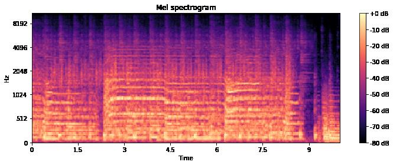
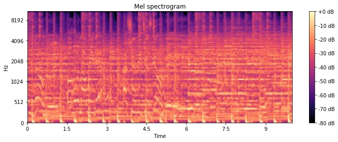
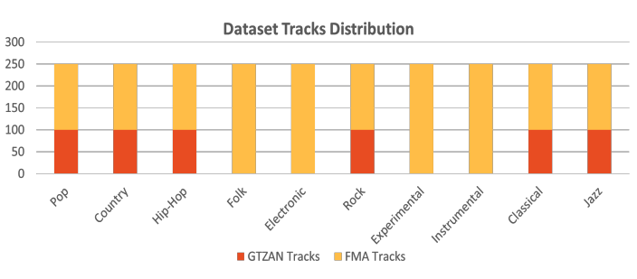
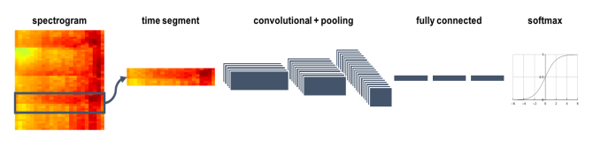
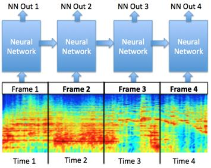
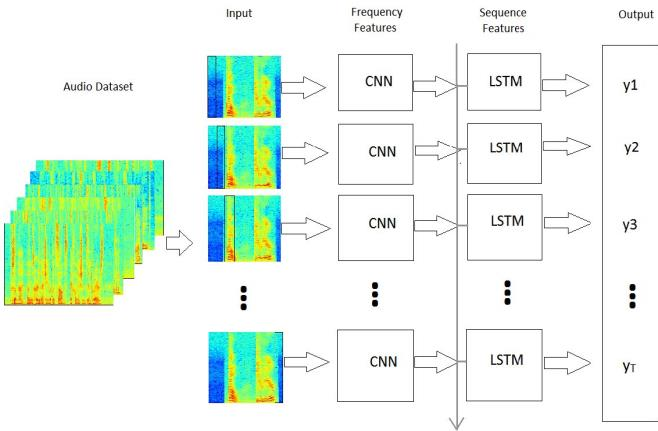
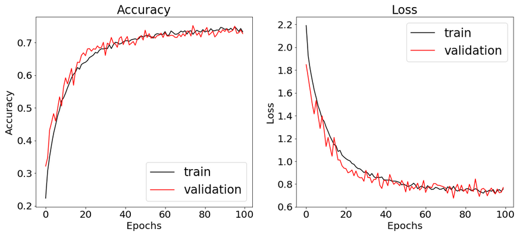
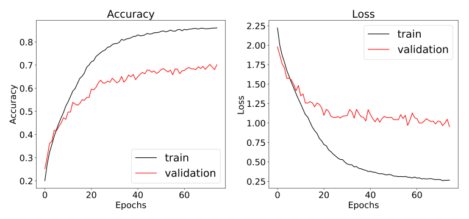
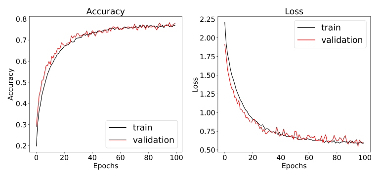

# Music Genres Classifier
Classifying music genres using deep learning models which are Convolution Neural Network, Recurrent Neural Network and finally, a mix of a convolution network followed by a recurrent network (C-RNN).

## Idea and Problem Statement

Music genres are categories that have arisen through a complex interplay of cultures, artists, and market forces to characterize similarities between compositions and organize music collections. Yet the boundaries between genres remain fuzzy, making the problem of music genre recognition (MGR) a nontrivial task. In addition, The dramatic increase in the amount of published music all over the web has created a two challenges:
* The need to automatically organize a collection 
* The need to automatically recommend new songs to a user knowing their listening habits.

Thus, we need to is to be able to group songs in semantic categories using artificial intelligence techniques. Accordingly, we proposed a solution to this problem as follows: given a music track, our aim is to classify its genre as one of 10 different genres through a deep learning model. 

## Mathematical background / Data Pre-processing

Each audio track is converted to an image-like format using a common signal processing technique called Mel-spectrograms. Input files are moved to Mel-spectrogram domain.
Tracks belonging to the same genre can produce similar patterns as shown in the picture Also, each track is divided to a fixed number of windows. 

For the sake of noticing the difference between each genre, we present 2 images of different genres. (see Figure 1, 2)

​																										Fig. 1. Rock Genre Spectrogram

​																										Fig. 2. Pop Genre Spectrogram

## Dataset

Due to the lack of enough resources to load a large number of tracks from the heavy FMA dataset and in order to have a more reliable, balanced dataset, we created a new dataset and used it for training; the newly created dataset was a combination of GTZAN and FMA dataset . Since the GTZAN and the FMA datasets have different genres labels, we needed to take different portions from different genres from the 2 datasets. It is composed in total of 2,500 tracks split into 10 different balanced genres, each track is 30 seconds. The dataset is divided into training, validation and testing sets with a ratio of 8:1:1.

​																										        Fig. 3. Dataset Distribution

## Architecture

### Model A (CNN)

5 convolutional layers each followed by a max pooling layer and a dropout layer in order to prevent overfitting. Then, a fully-connected neural network of 2-hidden layers which produces the final scores of each genre.

### Model B (RNN)

As a different approach to the problem, instead of extracting features using the convolutional neural network, we tried adding the memory element to the classification problem in order to make the scores of the genres for a certain song depend on the previous windows of that track. So, a recurrent neural network was used in the form of a Long Short-Term Memory (LSTM) model. The model wa composed of a LSTM layer of 128 neurons and a dropout of 50% and then the output of the LSTM layer was flattened and fed into a fully-connected neural network of 3-hidden3 layers with 150, 100, 50 neurons respectively and a final output layer for the scores of the classes.

### Model C (C-RNN)

After achieving good results with the RNN model approach (close to that of the CNN model), we tried merging between the two models to get the best results out of them both through a Convolutional Recurrent Neural Network; where the Convolutional Neural Network extracts the features of each track window; then these features are fed into an Recurrent Neural Network to make the classification decision depend on all the previous windows and then finally the output of the LSTM is fed into the Fully-Connected Neural Network to get the final classificationscores of the classes. The CNN has 5 layers and the RNN is composed of one LSTM layer of 128 neurons; and finally, the FCNN is similar to the previous two approaches with 3 hidden layers.

## Results

### Model A (CNN)

Using the CNN architecture mentioned above, the results achieved are promising. Whereas, a CNN network of almost 370K weights can predict the correct genre out of 10 possible genres with an accuracy 73%.

### Model B (RNN)

Using an RNN architecture, the network reached an accuracy of 68.66% which is considered good but cannot outscore the CNN architecture. The loss was high.

### Model C (CRNN)

Finally, we combined the previous 2 networks to form a convolution network followed by a RNN network as an experiment. This has proved to provide superior results. It outscored both the RNN and the CNN architectures. It reached a testing accuracy of 77.2%.

## References

* The GTZAN dataset: Its contents, its faults, their effects on evaluation, and its future use Bob L. Sturm, June 10, 2013
* FMA: A DATASET FOR MUSIC ANALYSIS Michaël Defferrard Kirell Benzi Pierre Vandergheynst Xavier Bresson 
* De Eguino, M. (2017). Deep Music Genre. Stanford University.
* Guo, I., Gu,Z., and Liu,T., “Music Genre Classification via Machine Learning,” CS 299 Final Project, 2017.
